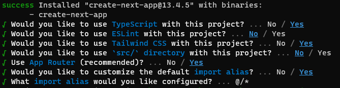
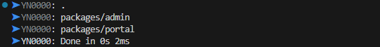

# [Guide] Template 바닥부터 구축하기

완전 바닥부터 Template를 만들고 싶은 당신을 위한 가이드!

---

## **프로젝트 생성**

<br>

1. **생성하고 싶은 폴더에서 터미널을 열어주세요**

1. `project name` **으로 Next.js 프로젝트 생성**

   ```bash
   yarn create next-app [project name]
   ```

1. **Yes, No, Yes, No, Yes, Yes, Tab, Enter**

   

1. **yarn berry로 버전 변경 및 yarn.lock 마이그레이션**

   ```bash
   yarn set version berry
   ```

   ```bash
   yarn install
   ```

1. `.gitignore` **파일을 수정해 yarn berry gitignore 설정**

   `root/.gitignore`

   ```bash
   # .gitignore
   ...

   .yarn/*
   !.yarn/cache
   !.yarn/patches
   !.yarn/plugins
   !.yarn/releases
   !.yarn/sdks
   !.yarn/versions
   ```

1. **yarn workspace 폴더 생성 및 root** `package.json` **workspace 추가**

   ```bash
   root ─ packages ┬ portal
                   └ admin
   ```

   `root/package.json`

   ```bash
   # package.json
   "workspaces": [
        "packages/portal",
        "packages/admin"
   ],
   ```

1. **각 workspace에 yarn 시작 명령어 실행 및 확인**

   ```bash
   cd packages/portal
   yarn init -y

   cd ../admin
   yarn init -y
   ```

   ```bash
   yarn workspaces list
   ```

   

1. **Next.js 관련 파일 모두 packages/portal 폴더로 이동**

1. **Next.js Turbopack 사용을 위해 NPM SCRIPT 수정**

   `next dev → next dev --turbo`

   ```json
   {
     "name": "@project/portal",
     "version": "0.1.0",
     "private": true,
     "scripts": {
       "start:local": "env-cmd -f .env.local next dev --turbo",
        ...
     },
     ...
   }
   ```

1. **Dockerlizing을 위해 Next.js config 수정**

   `next.config.js`

   ```js
   const nextConfig = {
     images: {
       // (option) serverless dockerlizing을 위해(.next/cache에 파일을 기록하려다 오류가 발생하는것 방지)
       unoptimized: true,
     },
     output: "standalone", // dockerlizing을 위해
   };
   ```

1. **package.json 열심히 설정**

---

## **Dependency 설치**

<br>

- ### **Storybook**

  ```bash
  npx storybook@latest init
  ```

- ### **Vitest**

  ```bash
  yarn add -D vitest
  yarn add -D @vitejs/plugin-react
  yarn add -D jsdom @testing-library/react @testing-library/jest-dom @testing-library/user-event @types/testing-library__user-event
  ```

- ### **daisy UI**

  ```bash
  yarn add -D daisyui
  ```

  `root/packages/[yarn workspace]/tailwind.config.js`

  ```js
  module.exports = {
    //...
    plugins: [require("daisyui")],
  };
  ```

- ### **Emotion**

  ```bash
  yarn add @emotion/react @emotion/styled
  ```
